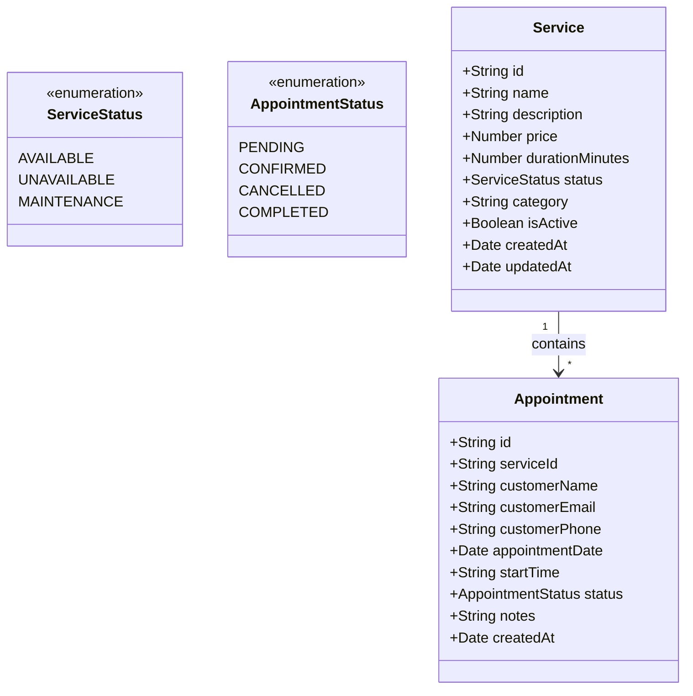

```mermaid
classDiagram
direction TB

class ServiceStatus {
<<enumeration>>
AVAILABLE
UNAVAILABLE
MAINTENANCE
}

class AppointmentStatus {
<<enumeration>>
PENDING
CONFIRMED
CANCELLED
COMPLETED
}

class Service {
+String id
+String name
+String description
+Number price
+Number durationMinutes
+ServiceStatus status
+String category
+Boolean isActive
+Date createdAt
+Date updatedAt
}

class Appointment {
+String id
+String serviceId
+String customerName
+String customerEmail
+String customerPhone
+Date appointmentDate
+String startTime
+AppointmentStatus status
+String notes
+Date createdAt
}

Service "1" --> "*" Appointment : contains
```