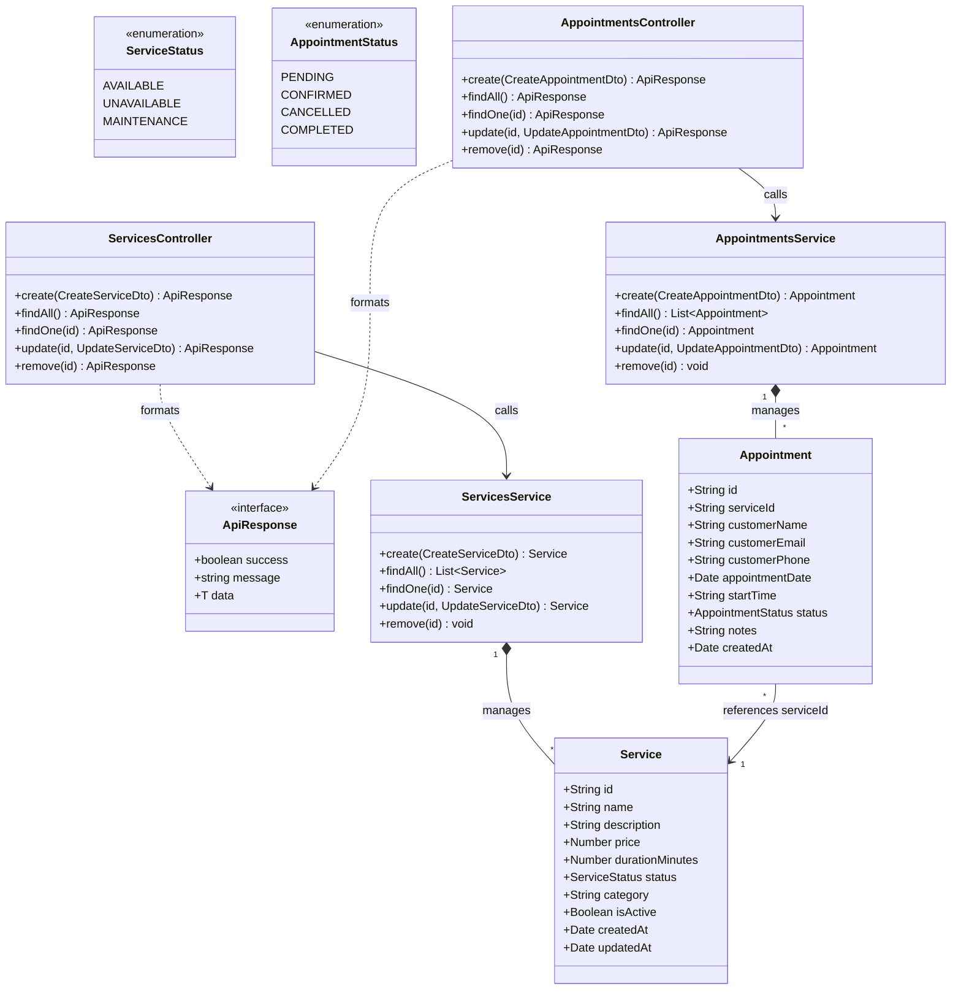

```mermaid
classDiagram
    direction TB

    class ApiResponse {
        <<interface>>
        +boolean success
        +string message
        +T data
    }

    class ServiceStatus {
        <<enumeration>>
        AVAILABLE
        UNAVAILABLE
        MAINTENANCE
    }

    class AppointmentStatus {
        <<enumeration>>
        PENDING
        CONFIRMED
        CANCELLED
        COMPLETED
    }

    class Service {
        +String id
        +String name
        +String description
        +Number price
        +Number durationMinutes
        +ServiceStatus status
        +String category
        +Boolean isActive
        +Date createdAt
        +Date updatedAt
    }

    class Appointment {
        +String id
        +String serviceId
        +String customerName
        +String customerEmail
        +String customerPhone
        +Date appointmentDate
        +String startTime
        +AppointmentStatus status
        +String notes
        +Date createdAt
    }

    class ServicesController {
        +create(CreateServiceDto) ApiResponse
        +findAll() ApiResponse
        +findOne(id) ApiResponse
        +update(id, UpdateServiceDto) ApiResponse
        +remove(id) ApiResponse
    }

    class AppointmentsController {
        +create(CreateAppointmentDto) ApiResponse
        +findAll() ApiResponse
        +findOne(id) ApiResponse
        +update(id, UpdateAppointmentDto) ApiResponse
        +remove(id) ApiResponse
    }

    class ServicesService {
        +create(CreateServiceDto) Service
        +findAll() List~Service~
        +findOne(id) Service
        +update(id, UpdateServiceDto) Service
        +remove(id) void
    }

    class AppointmentsService {
        +create(CreateAppointmentDto) Appointment
        +findAll() List~Appointment~
        +findOne(id) Appointment
        +update(id, UpdateAppointmentDto) Appointment
        +remove(id) void
    }

    ServicesController --> ServicesService : calls
    AppointmentsController --> AppointmentsService : calls
    
    ServicesService "1" *-- "*" Service : manages
    AppointmentsService "1" *-- "*" Appointment : manages
    
    Appointment "*" --> "1" Service : references serviceId
    
    ServicesController ..> ApiResponse : formats
    AppointmentsController ..> ApiResponse : formats
```