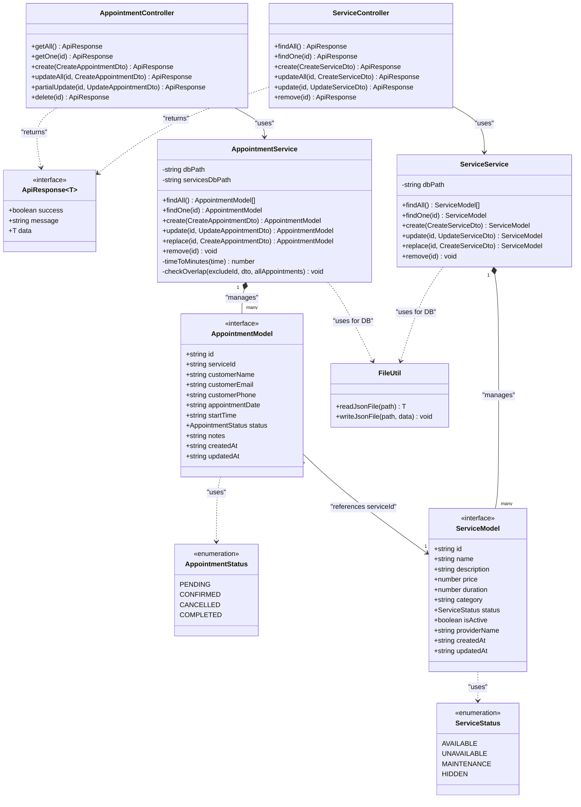

```mermaid
classDiagram
    direction TB

    class ApiResponse~T~ {
        <<interface>>
        +boolean success
        +string message
        +T data
    }

    class ServiceStatus {
        <<enumeration>>
        AVAILABLE
        UNAVAILABLE
        MAINTENANCE
        HIDDEN
    }

    class AppointmentStatus {
        <<enumeration>>
        PENDING
        CONFIRMED
        CANCELLED
        COMPLETED
    }

    class ServiceModel {
        <<interface>>
        +string id
        +string name
        +string description
        +number price
        +number duration
        +string category
        +ServiceStatus status
        +boolean isActive
        +string providerName
        +string createdAt
        +string updatedAt
    }

    class AppointmentModel {
        <<interface>>
        +string id
        +string serviceId
        +string customerName
        +string customerEmail
        +string customerPhone
        +string appointmentDate
        +string startTime
        +AppointmentStatus status
        +string notes
        +string createdAt
        +string updatedAt
    }

    class ServiceController {
        +findAll() ApiResponse
        +findOne(id) ApiResponse
        +create(CreateServiceDto) ApiResponse
        +updateAll(id, CreateServiceDto) ApiResponse
        +update(id, UpdateServiceDto) ApiResponse
        +remove(id) ApiResponse
    }

    class AppointmentController {
        +getAll() ApiResponse
        +getOne(id) ApiResponse
        +create(CreateAppointmentDto) ApiResponse
        +updateAll(id, CreateAppointmentDto) ApiResponse
        +partialUpdate(id, UpdateAppointmentDto) ApiResponse
        +delete(id) ApiResponse
    }

    class ServiceService {
        -string dbPath
        +findAll() ServiceModel[]
        +findOne(id) ServiceModel
        +create(CreateServiceDto) ServiceModel
        +update(id, UpdateServiceDto) ServiceModel
        +replace(id, CreateServiceDto) ServiceModel
        +remove(id) void
    }

    class AppointmentService {
        -string dbPath
        -string servicesDbPath
        +findAll() AppointmentModel[]
        +findOne(id) AppointmentModel
        +create(CreateAppointmentDto) AppointmentModel
        +update(id, UpdateAppointmentDto) AppointmentModel
        +replace(id, CreateAppointmentDto) AppointmentModel
        +remove(id) void
        -timeToMinutes(time) number
        -checkOverlap(excludeId, dto, allAppointments) void
    }

    class FileUtil {
        +readJsonFile(path) T
        +writeJsonFile(path, data) void
    }

    %% Relationships
    ServiceController --> ServiceService : "uses"
    AppointmentController --> AppointmentService : "uses"
    
    ServiceService ..> FileUtil : "uses for DB"
    AppointmentService ..> FileUtil : "uses for DB"
    
    ServiceService "1" *-- "many" ServiceModel : "manages"
    AppointmentService "1" *-- "many" AppointmentModel : "manages"
    
    AppointmentModel "*" --> "1" ServiceModel : "references serviceId"
    
    ServiceModel ..> ServiceStatus : "uses"
    AppointmentModel ..> AppointmentStatus : "uses"
    
    ServiceController ..> ApiResponse : "returns"
    AppointmentController ..> ApiResponse : "returns"
```