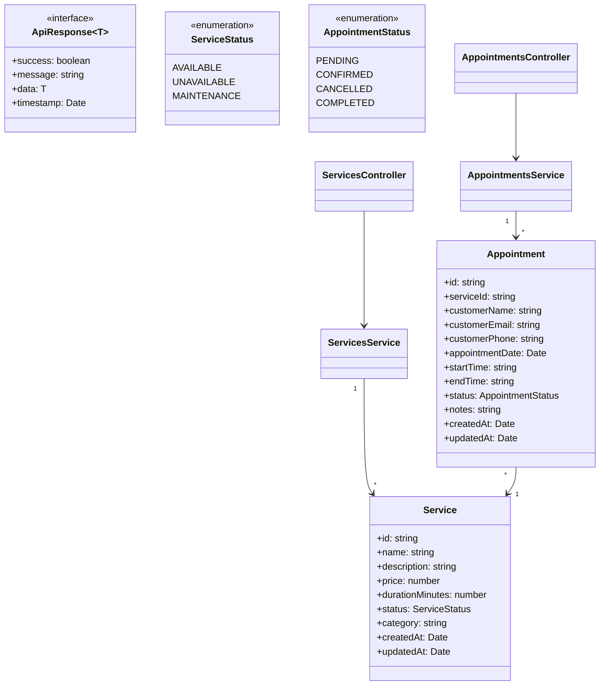

## 📊 UML Class Diagram

```mermaid
classDiagram
    direction TB

    class ApiResponse~T~ {
        <<interface>>
        +success: boolean
        +message: string
        +data: T
        +timestamp: Date
    }

    class ServiceStatus {
        <<enumeration>>
        AVAILABLE
        UNAVAILABLE
        MAINTENANCE
    }

    class AppointmentStatus {
        <<enumeration>>
        PENDING
        CONFIRMED
        CANCELLED
        COMPLETED
    }

    class Service {
        +id: string
        +name: string
        +description: string
        +price: number
        +durationMinutes: number
        +status: ServiceStatus
        +category: string
        +createdAt: Date
        +updatedAt: Date
    }

    class Appointment {
        +id: string
        +serviceId: string
        +customerName: string
        +customerEmail: string
        +customerPhone: string
        +appointmentDate: Date
        +startTime: string
        +endTime: string
        +status: AppointmentStatus
        +notes: string
        +createdAt: Date
        +updatedAt: Date
    }

    class ServicesController
    class AppointmentsController
    class ServicesService
    class AppointmentsService

    ServicesController --> ServicesService
    AppointmentsController --> AppointmentsService

    ServicesService "1" --> "*" Service
    AppointmentsService "1" --> "*" Appointment

    Appointment "*" --> "1" Service
```
