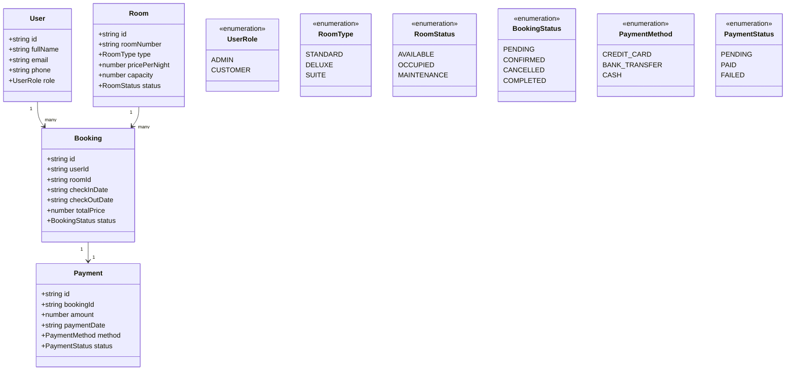

```mermaid
classDiagram

class User {
  +string id
  +string fullName
  +string email
  +string phone
  +UserRole role
}

class Room {
  +string id
  +string roomNumber
  +RoomType type
  +number pricePerNight
  +number capacity
  +RoomStatus status
}

class Booking {
  +string id
  +string userId
  +string roomId
  +string checkInDate
  +string checkOutDate
  +number totalPrice
  +BookingStatus status
}

class Payment {
  +string id
  +string bookingId
  +number amount
  +string paymentDate
  +PaymentMethod method
  +PaymentStatus status
}

class UserRole {
  <<enumeration>>
  ADMIN
  CUSTOMER
}

class RoomType {
  <<enumeration>>
  STANDARD
  DELUXE
  SUITE
}

class RoomStatus {
  <<enumeration>>
  AVAILABLE
  OCCUPIED
  MAINTENANCE
}

class BookingStatus {
  <<enumeration>>
  PENDING
  CONFIRMED
  CANCELLED
  COMPLETED
}

class PaymentMethod {
  <<enumeration>>
  CREDIT_CARD
  BANK_TRANSFER
  CASH
}

class PaymentStatus {
  <<enumeration>>
  PENDING
  PAID
  FAILED
}

User "1" --> "many" Booking
Room "1" --> "many" Booking
Booking "1" --> "1" Payment
```
